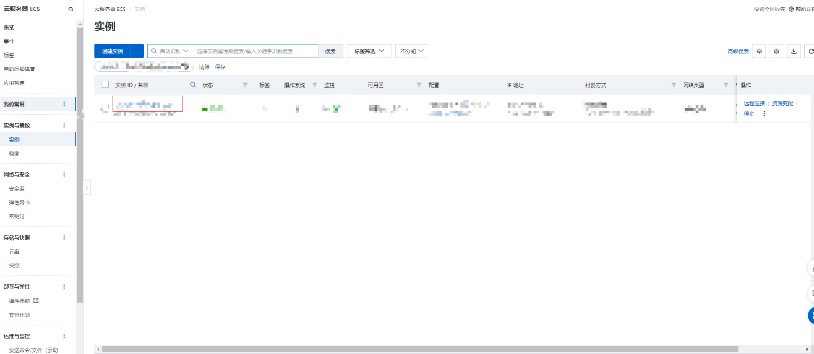

1.通过阿里云购买云服务器并进行配置
进入实例 => 安全组 =>安全组列表=>快速添加 ，

安全组添加

2.进入控制台，安装操作系统, 可在实例详情中查看操作系统版本
sudo apt-get update    // 更新一下软件源，获取最新软件的列表
sudo apt-get install 软件名   // 安装软件

// 查看系统版本
lsb_release -a 

3.安装nodejs
sudo apt-get install nodejs
sudo apt install nodejs-legacy
sudo apt install npm

// 可查看node版本查看安装成功与否
node -v 
v12.22.9
npm -v
8.5.1
4.安装nginx
nginx,反向代理。正向代理，客户端不想让服务器知道客户端的ip，所以让代理服务器去访问，再返回给客户端。
反向代理，服务器不想客户端知道是哪个服务器响应的，所以让代理服务器去分配，让空闲的服务器去响应。
sudo apt-get install nginx  
5.配置nginx（配置暂时有问题，配置完nginx.conf需要杀掉nginx进程重新启动， 修改nginx.conf文件的 server 80端口等 通过reload指令会失效）

########### 每个指令必须有分号结束。#################
#user administrator administrators;  #配置用户或者组，默认为nobody nobody。
#worker_processes 2;  #允许生成的进程数，默认为1
#pid /nginx/pid/nginx.pid;   #指定nginx进程运行文件存放地址
error_log log/error.log debug;  #制定日志路径，级别。这个设置可以放入全局块，http块，server块，级别以此为：debug|info|notice|warn|error|crit|alert|emerg
events {
    accept_mutex on;   #设置网路连接序列化，防止惊群现象发生，默认为on
    multi_accept on;  #设置一个进程是否同时接受多个网络连接，默认为off
    #use epoll;      #事件驱动模型，select|poll|kqueue|epoll|resig|/dev/poll|eventport
    worker_connections  1024;    #最大连接数，默认为512
}
http {
    include       mime.types;   #文件扩展名与文件类型映射表
    default_type  application/octet-stream; #默认文件类型，默认为text/plain
    #access_log off; #取消服务日志    
    log_format myFormat '$remote_addr–$remote_user [$time_local] $request $status $body_bytes_sent $http_referer $http_user_agent $http_x_forwarded_for'; #自定义格式
    access_log log/access.log myFormat;  #combined为日志格式的默认值
    sendfile on;   #允许sendfile方式传输文件，默认为off，可以在http块，server块，location块。
    sendfile_max_chunk 100k;  #每个进程每次调用传输数量不能大于设定的值，默认为0，即不设上限。
    keepalive_timeout 65;  #连接超时时间，默认为75s，可以在http，server，location块。

    upstream mysvr {   
      server 127.0.0.1:80;
      server 192.168.10.121:3333 backup;  #热备
    }
    error_page 404 https://www.baidu.com; #错误页
    server {
        keepalive_requests 120; #单连接请求上限次数。
        listen       80;   #监听端口
        server_name  127.0.0.1;   #监听地址       
        location  ~*^.+$ {       #请求的url过滤，正则匹配，~为区分大小写，~*为不区分大小写。
           #root path;  #根目录
           #index vv.txt;  #设置默认页
           proxy_pass  http://mysvr;  #请求转向mysvr 定义的服务器列表
           #deny 127.0.0.1;  #拒绝的ip
           allow 172.24.212.85; #允许的ip           
        } 
    }
}
user www-data;
worker_processes auto;
pid /run/nginx.pid;

events {
        worker_connections 768;
        # multi_accept on;
}

http {

        ##
        # Basic Settings
        ##

        sendfile on;
        tcp_nopush on;
        tcp_nodelay on;
        keepalive_timeout 65;
        types_hash_max_size 2048;
        # server_tokens off;

        # server_names_hash_bucket_size 64;
        # server_name_in_redirect off;

        include /etc/nginx/mime.types;
        default_type application/octet-stream;

        ##
        # SSL Settings
        ##

        ssl_protocols TLSv1 TLSv1.1 TLSv1.2; # Dropping SSLv3, ref: POODLE
        ssl_prefer_server_ciphers on;

        ##
        # Logging Settings
        ##

        access_log /var/log/nginx/access.log;
        error_log /var/log/nginx/error.log;

        ##
        # Gzip Settings
        ##

        gzip on;
        gzip_disable "msie6";

        # gzip_vary on;
        # gzip_proxied any;
        # gzip_comp_level 6;
        # gzip_buffers 16 8k;
        # gzip_http_version 1.1;
        # gzip_types text/plain text/css application/json application/javascript text/xml application/xml application/xml+rss text/javascript;

        ##
        # Virtual Host Configs
        ##

        #include /etc/nginx/conf.d/*.conf;
        #include /etc/nginx/sites-enabled/*;
        server {
                listen 80 default_server;
                listen [::]:80 default_server;

                # SSL configuration
                #
                # listen 443 ssl default_server;
                # listen [::]:443 ssl default_server;
                #
                # Note: You should disable gzip for SSL traffic.
                # See: https://bugs.debian.org/773332
                #
                # Read up on ssl_ciphers to ensure a secure configuration.
                # See: https://bugs.debian.org/765782
                #
                # Self signed certs generated by the ssl-cert package
                # Don't use them in a production server!
                #
                # include snippets/snakeoil.conf;

                root /var/www;

                # Add index.php to the list if you are using PHP
                index index.html index.htm index.nginx-debian.html;

                server_name _;

                location / {
                        # First attempt to serve request as file, then
                        # as directory, then fall back to displaying a 404.
                        try_files $uri $uri/ =404;
                }

                # pass the PHP scripts to FastCGI server listening on 127.0.0.1:9000
                #
                #location ~ \.php$ {
                #       include snippets/fastcgi-php.conf;
                #
                #       # With php7.0-cgi alone:
                #       fastcgi_pass 127.0.0.1:9000;
                #       # With php7.0-fpm:
                #       fastcgi_pass unix:/run/php/php7.0-fpm.sock;
                #}

                # deny access to .htaccess files, if Apache's document root
                # concurs with nginx's one
                #
                #location ~ /\.ht {
                #       deny all;
                #}
        }
}

#mail {
#       # See sample authentication script at:
#       # http://wiki.nginx.org/ImapAuthenticateWithApachePhpScript
#
#       # auth_http localhost/auth.php;
#       # pop3_capabilities "TOP" "USER";
#       # imap_capabilities "IMAP4rev1" "UIDPLUS";
#
#       server {
#               listen     localhost:110;
#               protocol   pop3;
#               proxy      on;
#       }
#
#       server {
#               listen     localhost:143;
#               protocol   imap;
#               proxy      on;
#       }
#}
重新启动nginx，这样就可以正常访问了

6.域名购买和配置解析
通过阿里云、腾讯云、华为云等买购买域名，阿里云买域名前需要在信息模板中添加实名认证，大概6小时出认证结果，购买好后就可以进行域名解析，我直接在解析中选择新手引导，输入服务器的IPV4，就可以进行解析。但是解析完的状态是失败的，显示是需要等一两天，通过找客服进行域名解析诊断，立马就解析成功了

通过域名解析自助诊断解决了云解析DNS不生效问题

也可以直接添加解析配置

7.免费阿里云切换到腾讯云了
服务器等的购买设置和阿里云差不多。
由于之前阿里云和域名已经解析了，需要重新设置域名解析
